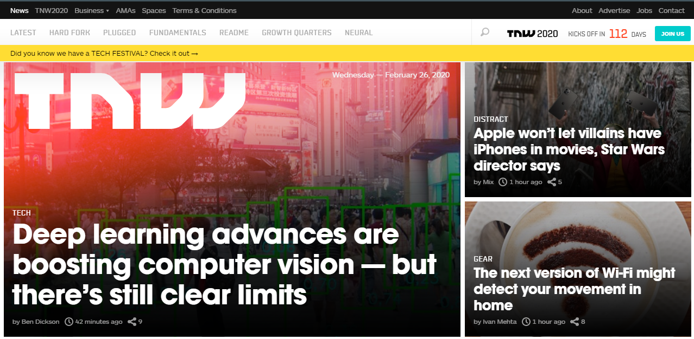

## TheNextWeb.com 
 The goal of this project is to clone TheNextWeb.com website (TNW) with responsive design.

## Requirements
Use a mobile first approach with @media queries and its associated breakpoints, selectors, and css rules.

## Built With

- Html5 and CSS3  
- Stickler-CI (Linter) and W3C validator  
- Git, Github and VScode  

## Live Demo
To see the live demo go to: https://raw.githack.com/SevlaMare/thenextweb-clone/feature/index.html

## Authors

👤 **Paul Gureghian**

- Github: [githubhandle](https://github.com/paulgureghian)
- Twitter: [#twitterhandle](https://twitter.com/paulgureghian)
- Linkedin: [linkedin](https://www.linkedin.com/in/paulgureghian/)

👤 **Thiago Miranda**

- Github: [SevlaMare](https://github.com/SevlaMare)
- Twitter: [#SevlaMare](https://twitter.com/SevlaMare)
- Linkedin: [sevlamare](https://www.linkedin.com/in/sevlamare)

## More Details 
https://theodinproject.com/courses/html5-and-css3/lessons/building-with-responsive-design